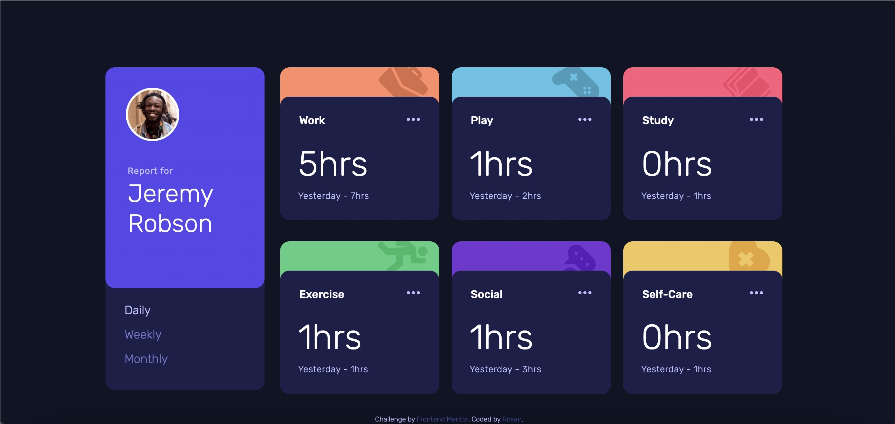

# Frontend Mentor - Time tracking dashboard solution

This is a solution to the [Time tracking dashboard challenge on Frontend Mentor](https://www.frontendmentor.io/challenges/time-tracking-dashboard-UIQ7167Jw). Frontend Mentor challenges help you improve your coding skills by building realistic projects.

## Table of contents

- [Overview](#overview)
  - [The challenge](#the-challenge)
  - [Screenshot](#screenshot)
  - [Links](#links)
- [My process](#my-process)
  - [Built with](#built-with)
  - [What I learned](#what-i-learned)
  - [Continued development](#continued-development)
- [Author](#author)

## Overview

### The challenge

Users should be able to:

- View the optimal layout for the site depending on their device's screen size
- See hover states for all interactive elements on the page
- Switch between viewing Daily, Weekly, and Monthly stats

### Screenshot

### Links

- Solution URL: [Add solution URL here](https://your-solution-url.com)
- Live Site URL: [Add live site URL here](https://your-live-site-url.com)

## My process

### Built with

- CSS custom properties
- Flexbox
- Mobile-first workflow
- [JQuery](https://jquery.com/) - JS library
- [Bootstrap v5](https://getbootstrap.com/) - CSS Framework
- [SASS](https://sass-lang.com/) - CSS Extension

### What I learned

I learned how to use SASS in this project. I also got to use it alongside Bootstrap, though I mainly used bootstrap for the containers.

This was also a practice for using JQuery. I'm quite happy with the functions I created on this project. I managed to make them reusable to avoid a lot of unnecessary code repetitions. I also did a little extra function to this app. The challenge only had us update the timeframe for all modules at once, but i added a little drop down menu to be able to change the timeframe for each module individually.

### Continued development

In the future, I would like to play around with the concept of draggable and sortable divs using JQuery or React.

## Author

- Website - [Roxan](TBA)
- Frontend Mentor - [@Roxan CE](https://www.frontendmentor.io/profile/Roxan-CE)
- GitHub - [@Roxan-CE](https://github.com/Roxan-CE)
